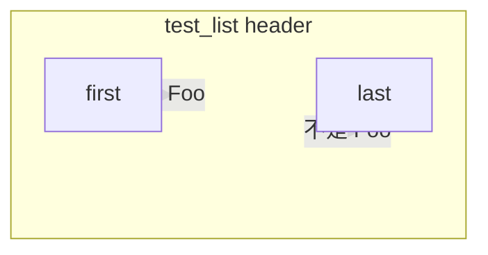
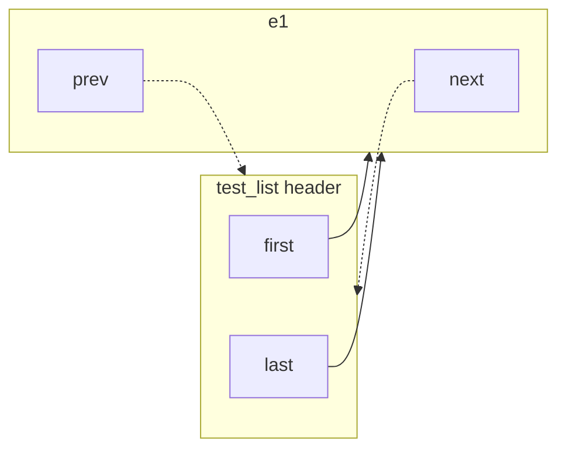
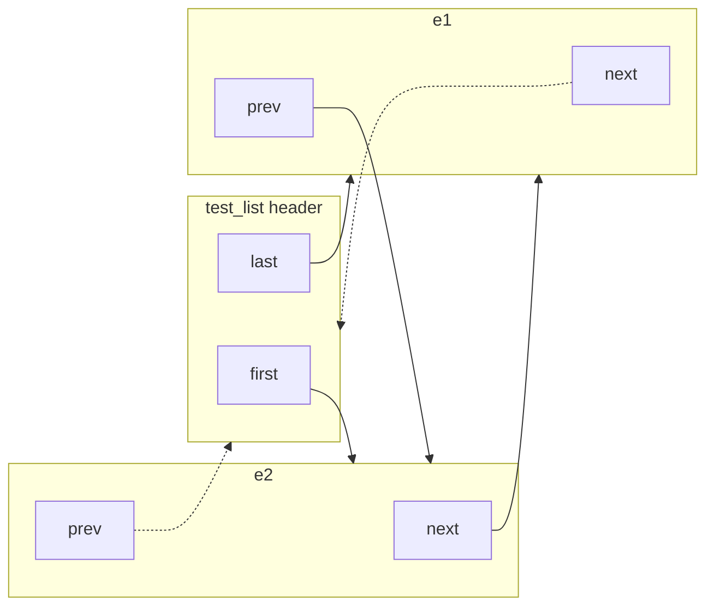

# 13. Certain `utils/` 通用组件原理

`certain/utils/` 是共识流水线下面那一层：侵入式链表、无锁队列、时间轮、LRU、固定槽位内存池、协程 Worker、限流与去重。它们几乎不依赖 Paxos 语义，但 `EntityInfo`、`ArrayTimer`、`UuidMng` 和 Worker 之间的投递都建立在这上面。

本文按「结构 → 不变量 → 在 Certain 里怎么用」写，并单独把 `LIGHTLIST` 和 Linux `list_head` 做对照与实测。文件级清单仍见 [12. 逐文件索引](./12_DETAILED_FILE_BY_FILE_INDEX.md)。

---

## 1. 这层代码在干什么

Certain 的热路径有三个约束：

1. **对象已经存在**，只是要挂到另一张表上（超时轮、LRU、某个 Entity 的 in-flight Entry）。再 `new` 一个链表节点会多一次分配、多一次间接跳转。
2. **单线程认领一块 entity_id**（`EntityWorker`），所以很多结构故意不是线程安全的；跨线程的只有 `LockFreeQueue`。
3. **要能 O(1) 问「这个对象现在还在不在某张表里」**。定时器 `Add`/`Remove`、LRU `Refresh` 都先做 membership，再决定是否插入。

因此这里出现的是侵入式链表 + 时间轮 + 哈希表，而不是 `std::list` / `std::multimap`。

```
                    单线程 EntityWorker
  ClientCmd ──LockFreeQueue──▶ RoutineWorker 协程
                    │
                    ├─ ArrayTimer<EntityInfo>     LIGHTLIST 时间轮
                    ├─ EntityInfo.entry_list      LIGHTLIST 挂 EntryInfo
                    ├─ LruTable / UuidMng         哈希 + LIGHTLIST
                    └─ TrafficLimiter             令牌桶（Catchup）
```

---

## 2. `LIGHTLIST`：带哨兵头的侵入式双向链表

源码：[`certain/utils/light_list.h`](../certain/utils/light_list.h)。单元测试：[`certain/utils/light_list_test.cc`](../certain/utils/light_list_test.cc)。

### 2.1 它就是侵入式链表

节点不另分配「链表节点」：宿主结构体里嵌一套 `next` / `prev`。

```5:15:certain/utils/light_list.h
#define LIGHTLIST(ElementType) \
  struct {                     \
    ElementType* first;        \
    ElementType* last;         \
  }

#define LIGHTLIST_ENTRY(ElementType) \
  struct {                           \
    ElementType* next;               \
    ElementType* prev;               \
  }
```

`EntityInfo` 自己是链表头，`EntryInfo` 把自己嵌进去：

```37:40:certain/src/entity_info_mng.h
  int32_t ref_count;
  LIGHTLIST(EntryInfo) entry_list;

  ArrayTimer<EntityInfo>::EltEntry timer_entry;
```

这和内核 `list_head`、BSD `sys/queue.h` 的 `TAILQ` 是同一类东西，只是哨兵约定不同。

### 2.2 哨兵不另开节点：把头指针打到 header 自己身上

空表时 `first` / `last` 的静态类型仍是 `T*`，运行时却指向 **链表头对象**（不是任何一个 `T`）：

```17:30:certain/utils/light_list.h
#define LIGHTLIST_INIT(llist)                  \
  do {                                         \
    *(void**)&(llist)->first = (void*)(llist); \
    *(void**)&(llist)->last = (void*)(llist);  \
  } while (0)
...
#define ENTRY_IN_LIGHTLIST(elt, field) \
  ((elt)->field.next != NULL && (elt)->field.prev != NULL)
```

未入链的节点：`next = prev = NULL`。入链后两端节点的 `next`/`prev` 可能再次指向 header。所以：

- `LIGHTLIST_EMPTY`：`first == (void*)llist`
- `ENTRY_IN_LIGHTLIST`：两个指针都非 NULL（O(1)，不需要再找链表头）
- **空表时不能解引用 `LIGHTLIST_FIRST` / `LAST`**，它们指向的不是 `T`

下面按 `light_list_test.cc` 的 **`INSERT_HEAD`** 顺序：先 `e1` 再 `e2`，因此头是后插入的 `e2`，尾是先插入的 `e1`。虚线表示「静态类型是 `T*`，实际指向 header」。未入链节点的 `next`/`prev` 为 `NULL`，图中不画出。

**空表**（`LIGHTLIST_INIT`）：`first` / `last` 都指向 header 自己。`LIGHTLIST_EMPTY` 成立。不要解引用 `FIRST` / `LAST`。



**只插入 `e1`**：空表头插，`e1` 同时是头和尾；`e1.next` / `e1.prev` 回指 header。



**再头插 `e2`**：`first` 改为 `e2`；`last` 仍是 `e1`。链是 `header → e2 ⇄ e1 → header`。



指针一览（`INSERT_HEAD(e1)` 再 `INSERT_HEAD(e2)`）：

| 指针 | 空表 | 只有 e1 | 再插入 e2 |
| :--- | :--- | :--- | :--- |
| `first` | header | e1 | e2 |
| `last` | header | e1 | e1 |
| `e1.next` | `NULL` | header | header |
| `e1.prev` | `NULL` | header | e2 |
| `e2.next` | `NULL` | `NULL` | e1 |
| `e2.prev` | `NULL` | `NULL` | header |

`INSERT_HEAD` / `INSERT_TAIL` / `REMOVE` 都是若干指针赋值，并在「碰到 header」时改 `first`/`last`。`REMOVE` 结束时把节点重新打成 `NULL`，membership 立刻为假。

### 2.3 只展开 `light_list.h` 里的宏

`g++ -E` / `clang++ -E` 会展开**当前翻译单元里的全部宏**。直接预处理 `light_list_test.cc` 会把 googletest 的 `TEST` / `ASSERT_*` 也展开，输出几千行，看不清 `LIGHTLIST_*`。

预处理器没有「只替换这个头文件里的宏」这种开关。做法是：**不要 `#include` 其它头，只用 `-imacros` 注入 `light_list.h` 的 `#define`**（解析宏定义，不把该文件正文插入输出）：

```bash
# 单文件：先去掉 #include，再只注入 LIGHTLIST* 宏
sed -E 's|^[[:space:]]*#[[:space:]]*include|// include|' \
    certain/utils/light_list_test.cc > /tmp/ll.cc

clang++ -std=c++11 -E -P -C -x c++ \
    -imacros certain/utils/light_list.h \
    -I certain \
    /tmp/ll.cc
```

`utils/` 下三个调用点可以一次生成对照文件：

```bash
certain/tools/expand_light_list.sh
# 写出 certain/tools/light_list_expanded.cc
# 也可：certain/tools/expand_light_list.sh certain/utils/light_list_test.cc
```

`-P` 去掉 `# 行号 "文件"` 标记，`-C` 保留源文件注释。`TEST` / `ASSERT_*` / `std::unordered_map` 会原样留下，只有 `LIGHTLIST*` / `ENTRY_IN_LIGHTLIST` 被替换成 `struct { ... }` 和 `do { ... } while (0)`。

### 2.4 和 Linux `list_head` 差在哨兵，不差在「是不是侵入式」

内核链表（`include/linux/list.h`）是 **环形、同质** 的：

```
struct list_head { struct list_head *next, *prev; };

空表:  head.next = head.prev = &head
节点:  内嵌 list_head，用 list_entry / container_of 回到宿主
```

| | `LIGHTLIST` | Linux `list_head` |
| :--- | :--- | :--- |
| 头节点 | 独立的 `first` + `last`（`T*`） | 一个 dummy `list_head`，`next`/`prev` 即头尾 |
| 是否环形 | 否。端点的 next/prev 指向 header | 是。尾的 `next` 回到 dummy |
| 取第一个元素 | `llist->first`，已是 `T*` | `list_entry(head->next, T, member)`，要减 offset |
| 未入链 | `next=prev=NULL` | `list_del` 写成 poison；`list_del_init` 写成自环 |
| 判「在不在链上」 | `ENTRY_IN_LIGHTLIST` 两次 NULL | 必须约定 `list_del_init`，再用 `!list_empty(&node->link)` |
| 依赖 | 70 行宏，无内核头 | 用户态要自己抄一份 `list.h` |

`list_head` 的优点是：**所有 `list_head*` 都同质**，内核里一份代码可以挂 timer、inode、runqueue；dummy 和节点都是同一种指针，没有「这个 `T*` 其实指向 header」的双关。

Certain 不走这条路，更接近 BSD `TAILQ`：用户态 C++、要 typed `first`/`last`、并且 **membership 是一等公民**。`ArrayTimer::Exist` / `Add` 直接：

```174:180:certain/utils/array_timer.h
  bool Exist(T* elt) {
    if (ENTRY_IN_LIGHTLIST(elt, timer_entry.timer_list_entry)) {
      return true;
    } else {
      assert(elt->timer_entry.index == 0);
      return false;
```

若改用内核 `list_del`（poison），未初始化节点不能当「不在链上」；若一律 `list_del_init`，自环和「单元素环」在节点上看起来一样，API 也能用，但每个 unlink 都要多写两次「指向自己」的指针，且 `FIRST` 仍要 `container_of`。

代价也要说清楚：

1. **类型双关**：`*(void**)&llist->first = llist` 在严格别名规则下不优雅；空表时 `T*` 并不是 `T`。
2. **遍历必须停在 header**：`for (T* p = FIRST; (void*)p != (void*)list; p = p->field.next)`，不能把 `next` 当成永远有效的 `T*`。
3. **匿名 struct**：`LIGHTLIST(T)` 每次展开都是不同的无名类型，不能直接当函数参数类型，需要 `typedef LIGHTLIST(T) FooList`。

这些是 API / 安全模型上的取舍，不是「指针赋值会快一个数量级」。两边每个 insert/remove 都是常数次 store。

### 2.5 实测：`light_list_bench`

工具：[`certain/tools/light_list_bench.cc`](../certain/tools/light_list_bench.cc)。用户态抄了一份内核 `list_add` / `list_add_tail` / `list_del_init` / `list_empty`，并加了 `std::list<T*>` 作为非侵入式对照（每次 insert 堆上再分配一个 list 节点）。

```bash
cmake --build certain/build --target light_list_bench
# 文档数字来自单独的 RelWithDebInfo / -O2 构建：
./certain/build/bin/light_list_bench [n] [rounds]
# 默认 n=100000 rounds=80
```

环境：AMD EPYC 7K62（KVM，绑核 0），Ubuntu clang 17.0.6，`RelWithDebInfo`（`-O2 -g`），`CLOCK_MONOTONIC`，预热 3 轮后取 **中位数 ns/op**。节点预先分配好，热路径不再 `malloc`（`std::list` 除外）。

| 负载 | `LIGHTLIST` | `list_head` | `std::list<T*>` | 说明 |
| :--- | ---: | ---: | ---: | :--- |
| `insert_head` | 0.93 | 0.94 | 11.36 | 头插；后两者同量级，`std::list` 吃分配 |
| `insert_tail` | 0.93 | 0.94 | 11.23 | 尾插，同上 |
| `drain_head` | 2.23 | 4.02 | 10.25 | 反复取头并删除（时间轮 `TakeTimerElt` 同类） |
| `drain_tail` | 2.21 | 4.93 | — | 反复取尾并删除 |
| `iterate` | 1.30 | 1.30 | 3.53 | 只走不改 |
| `membership` | 0.66 | 0.67 | — | 一半在链上；`ENTRY_IN_LIGHTLIST` vs `!list_empty(node)` |
| `lru_touch` | 2.38 | 2.44 | — | `Remove` + 头插，对应 `LruTable::Refresh` |
| `remove_rand` | 8.72 | 8.80 | — | 伪随机下标，未命中则跳过 |

读法：

- **侵入 vs 非侵入** 才是数量级：`std::list` 插入大约 **12×**，因为每个元素额外 `new` 一个节点，并且遍历多一次指针跳。
- **`LIGHTLIST` vs `list_head`**：insert / iterate / membership / LRU / 随机删除都在 **5% 以内**，可以当成测量噪声。
- **drain 上 `LIGHTLIST` 更快（约 1.8×～2.2×）**：`FIRST`/`LAST` 已经是 `T*`，unlink 写成 NULL 而不是 `list_del_init` 的自环，也没有 `container_of` 回退。这是微基准里最明显的差距，但真实 `EntryInfo` 并不排成连续数组，两边都会变成指针追逐，不要外推成「生产一定快一倍」。

结论：Certain 选 `LIGHTLIST`，主要是 **typed 头尾、NULL 表示未入链、O(1) membership、不引入内核头**；性能上和 `list_head` 同档，显著好于 `std::list`。没有必要为了微秒差去换成 `list_head`。

---

## 3. 建立在 `LIGHTLIST` 上的两张表

### 3.1 `ArrayTimer`：毫秒槽位的环形时间轮

[`certain/utils/array_timer.h`](../certain/utils/array_timer.h)。不是 Linux 那种多层 hashed wheel，而是 **长度为 `max_timeout_msec+1` 的 `LIGHTLIST` 数组**，再加一条 `ready_list_`。

```
timer_list_[0 .. max_timeout]
        │  curr_index_ 随 GetTimeByMsec() 向前扫
        ▼
   每个槽位一条 LIGHTLIST<T>     到期 → 整条搬到 ready_list_
T 必须内嵌 ArrayTimer<T>::EltEntry
        ├─ index                 所在槽 / 已到期则为 uint32_t(-1)
        └─ timer_list_entry      LIGHTLIST_ENTRY
```

- `Add(elt, timeout_msec)`：先 `Exist`（`ENTRY_IN_LIGHTLIST`），再算槽 `curr_index_ + timeout`（绕回），头插。
- `Remove`：按 `index` 找到那条 list，O(1) 摘掉。
- `TakeTimerElt`：若 ready 空则把「从上次到现在」扫过的槽全部搬到 ready，然后取 **ready 的 LAST**（FIFO：先到期的在尾部附近，因为搬槽时用的是 `INSERT_HEAD`）。
- 墙钟回拨时把 `curr_time_msec` 钳到上次值，避免时间轮倒转。

`EntityInfo` 把 `timer_entry` 嵌在自己身上，超时走同一套轮，而不是每个命令一个 `timerfd`。

### 3.2 `LruTable`：哈希定位 + 链表记新旧

[`certain/utils/lru_table.h`](../certain/utils/lru_table.h)。`unordered_map<K, LruElt>` 存 KV，`LruElt` 里再嵌 `LIGHTLIST_ENTRY`。头 = 最新，尾 = 最旧。

- `Add`：已存在则摘下再头插（更新 value）；新 key 插入；可选 `auto_eliminate_` 超容量删最旧。
- `Refresh`：只动链表（头插变最新 / 尾插变最旧），哈希表不动。
- `PeekOldest` / `RemoveOldest`：`LIGHTLIST_LAST`。

`UuidMng` 每个分片一张 `LruTable<uint64_t, uint32_t>`，value 是超时秒。

---

## 4. `LockFreeQueue`：MPSC 环形缓冲

[`certain/utils/lock_free_queue.h`](../certain/utils/lock_free_queue.h)。流水线跨线程只走这个队列：多 Worker `PushByMultiThread`，对端单线程 `PopByOneThread`。

```
alignas(64) atomic<uint64_t> head_   生产者 CAS 占槽（逻辑下标，单调增）
alignas(64) atomic<uint64_t> tail_   消费者独占推进
items_[i % capacity] = unique_ptr<T> 槽位；未发布时为空
```

不变量：`Size() == head - tail`（无符号回绕下仍成立，因为差值在 `capacity` 内）。`head_` / `tail_` 分 cacheline，避免 false sharing。

Push：

1. 读 `h`、`t`；`h - t >= capacity` → `kUtilsQueueFull`。
2. `compare_exchange_strong(h, h+1)` 抢下标；失败则重试（默认 5 次，`-1` 表示死等），耗尽 → `kUtilsQueueConflict`。
3. 抢到后 `swap` 进 `items_[h % capacity]`。注意：**CAS 成功时槽里可能还是空的**，消费者若跑得太快会看到 `pop == nullptr`，同样返回 `kUtilsQueueConflict`，让调用方稍后再试。这是「先占下标、后放指针」的经典窗口。

Pop（单线程，不用 CAS）：`h == t` 为空；槽为空则 conflict；否则 `move` 出对象，`tail++`。

`unique_cast`（[`memory.h`](../certain/utils/memory.h)）把 `unique_ptr<Derived>` 转成队列元素基类，避免再拷一份。C++11 没有 `std::make_unique`，同文件补了一份。

---

## 5. `MemPool`：固定槽 + 下标环

[`certain/utils/mem_pool.h`](../certain/utils/mem_pool.h) / [`mem_pool.cc`](../certain/utils/mem_pool.cc)。

预分配 `buffer_`（`max_count * size`）和 `indexs_[0..max_count)` 的空闲下标。`first_index_` / `last_index_` 做成无界计数器，对 `max_count` 取模当环形队列：

- `Alloc(n)`：`n > size` 或池空 → `malloc`，`os_alloc_cnt_++`；否则弹出一个下标，返回 `buffer + idx * size`。
- `Free(p)`：指针落在 `buffer_` 区间外 → `free`；否则把下标推回环尾。

没有 per-block header，靠地址范围区分池内/池外。调用方必须按「同一 `MemPool` 分配的指针还给它」来用，不能把 A 池的指针还给 B 池。

---

## 6. 线程、协程、锁

### 6.1 `ThreadBase`

[`certain/utils/thread.h`](../certain/utils/thread.h)。`std::thread` 跑虚函数 `Run()`；`exit_flag_` / `stopped_` 为 atomic；`SetThreadName` / `SetAffinity` / `GetProcessorNum` 给 Worker 绑核。另外包了 `pthread_mutex` / `pthread_rwlock` 和对应的 RAII（`ThreadLock`、`ThreadReadLock`、`ThreadWriteLock`）。

### 6.2 `RoutineWorker<T>`

[`certain/utils/routine_worker.h`](../certain/utils/routine_worker.h)。一个 OS 线程 + `num_routines` 个 libco 协程 + `co_eventloop`：

```
Run():
  co_create × N，立刻 resume → 协程发现 job==null，把自己推进 idles_，yield
  co_eventloop(..., Tick):
      Tick()                         // 子类可做定时
      while idles_ 非空:
          job = GetJob()             // 通常从 LockFreeQueue pop
          若没有 job: break
          弹出一个 idle，resume 它
      exit_flag 则 eventloop 返回

每个协程:
  有 job → DoJob(move(job)) → job=null
  无 job → 进入 idles_，yield
```

这是 Entity / Plog / Catchup 等 Worker 的共同骨架：线程不再自己阻塞在队列上，而是 epoll tick 时把空闲协程喂饱。

### 6.3 `CoHashLock` 与 `Tick`

[`certain/utils/co_lock.h`](../certain/utils/co_lock.h) / [`co_lock.cc`](../certain/utils/co_lock.cc)。**不是**文档 11/12 里写过的 `CoMutex` / `DbEntityLock`（当前树里没有这两个类）。

- `CoHashLock(bucket_num)`：`mutex[]` 分桶，`Hash(id) % bucket`。
- 不在协程里：直接 `lock()`。
- 在协程里：`try_lock` 成功则返回；否则把当前协程记进 thread-local 等待表并 `co_yield_ct()`。
- `CheckAllLock()`：在 epoll tick 里对等待项再 `try_lock`，成功则 `co_resume`。第一次 `Lock` 时通过 `Tick::Add` 把这个检查挂到本线程的 tick 列表。

`AutoDisableHook`：RAII 暂时关掉 libco 的 syscall hook，避免某些路径被 hook 成「让出协程」。

`Tick`：thread-local 的 `vector<function<void()>>`，eventloop 里 `Tick::Run()` 一次跑完。

---

## 7. 限流、容量、UUID 去重

### 7.1 `CountLimiter` / `TrafficLimiter`

[`certain/utils/traffic_limiter.h`](../certain/utils/traffic_limiter.h)。单线程令牌桶，**不是**跨线程安全的。

- `CountLimiter::AcquireOne`：一秒窗口，窗口内 `remain_count_` 用完则拒绝，到点再灌满。
- `TrafficLimiter`：字节侧按 **10ms** 小周期灌 `max_bytes_per_interval`；次数侧按 1s。`UseBytes` / `UseCount` 在窗口未到时返回「还要睡多少毫秒」，给 Catchup 让出发送节奏，而不是丢包。单次申请大于一个窗口时，把 `next_time` 按比例往后推。

默认 `max_* = -1`（无符号最大值），等于未限流。

### 7.2 `SharedLimiter` / `CapacityLimiter`

[`certain/utils/capacity_limiter.h`](../certain/utils/capacity_limiter.h)。注释写明 **非线程安全**。`SharedLimiter` 是全局字节预算；`CapacityLimiter` 先过自己的 `max_capacity_`，再向 shared 申。网络收包、待写链表用这套防止单连接把进程打满。

### 7.3 `UuidMng`

[`certain/utils/uuid_mng.h`](../certain/utils/uuid_mng.h)。`Singleton`，1024 个分片，每片一把 `mutex` + 一张 `LruTable<uuid, timeout_sec>`。

- `Add(entity_id, uuid)`：超时 = 现在 + 60s。
- `Exist`：给客户端重试做幂等。
- `CheckTimeout`：弹出已过期的最旧项；或者分片超过 `kMaxMemUuidNum / kShardNum` 时强制淘汰，防止去重表无限涨。

`entity_id` 只用来选分片，表的 key 是 `uuid`。

---

## 8. 更小的砖块

| 文件 | 实际做什么 |
| :--- | :--- |
| [`singleton.h`](../certain/utils/singleton.h) | Meyer's singleton：`static T instance`，C++11 后初始化线程安全。禁止拷贝。 |
| [`hash.h`](../certain/utils/hash.h) | Murmur 风格 32-bit（常量 `m=0xc6a4a793`）。`entity_id` 分片、`CoHashLock` 分桶都用它。未对齐的 `*(uint32_t*)data` 在 x86 上能跑。 |
| [`crc32.h`](../certain/utils/crc32.cc) | 256 项表驱动的软件 CRC32，给 demo DB 的滚动校验，不是 CRC32 指令。 |
| [`time.h`](../certain/utils/time.h) | `gettimeofday` → μs / ms / s；`GetCurrentHour` 用 `localtime_r`。不是单调时钟，墙钟回拨时 `ArrayTimer` 自己钳位。 |
| [`usetime_stat.h`](../certain/utils/usetime_stat.h) | `TimeDelta` 两次 `GetTimeByUsec` 做差；`LocalUseTimeStat` 线程内累加 max/sum/count；`UseTimeStat` 用 atomic 汇总后打 `certain_stat` 日志。没有 P50/P90/P99。 |
| [`log.h`](../certain/utils/log.h) | 单例持有 `LogBase*`。`CERTAIN_LOG_*` 先比日志等级再格式化，避免关闭 Debug 时仍拼字符串。Fatal 顺带 `ReportFatalError`。 |
| [`macro_helper.h`](../certain/utils/macro_helper.h) | `CERTAIN_NO_COPYING_ALLOWED`、`GET_SET` / `GET_SET_ATOMIC`、`PANIC`（sleep 2 再 assert）。 |
| [`header.h`](../certain/utils/header.h) | 拉 `_GNU_SOURCE` 和一批 POSIX / STL 头，历史「预编译包」用法。 |
| [`memory.h`](../certain/utils/memory.h) | C++11 `make_unique` 补丁 + `unique_cast`。 |

---

## 9. 读源码时的对应关系

| 场景 | 组件 |
| :--- | :--- |
| Entity 上挂着哪些 in-flight Entry | `LIGHTLIST(EntryInfo) entry_list` |
| 命令 / Entity 超时 | `ArrayTimer` + `ENTRY_IN_LIGHTLIST` |
| UUID 60s 幂等 | `UuidMng` → 分片 `LruTable` |
| Worker 之间传 `unique_ptr<Cmd>` | `LockFreeQueue` MPSC |
| Worker 线程里跑 N 个协程 | `RoutineWorker` |
| Catchup 限速 | `TrafficLimiter` |
| 收包内存上限 | `CapacityLimiter` + `SharedLimiter` |
| 固定大小缓冲 | `MemPool` |

建议顺序：`light_list.h` → `array_timer.h` / `lru_table.h` → `lock_free_queue.h` → `routine_worker.h` → 再回头看 `EntityInfo` / 各 Worker。
